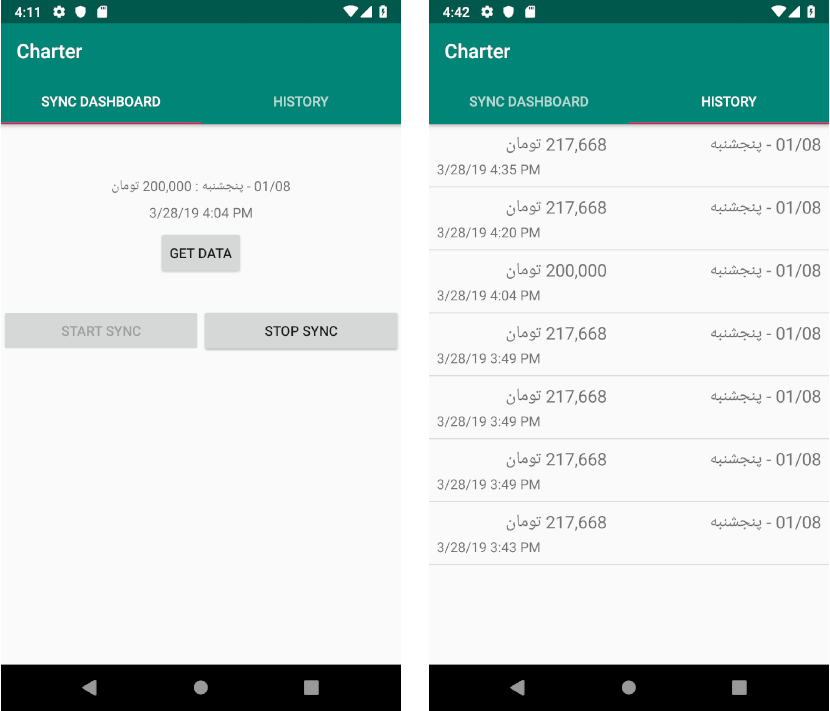

# Charter App - WIP

A sample Android application, written in Kotlin, to demonstrate how to build app while using WokerManager, Paging Library, Room. you can find out more information in persian in the links below:

[link 1](http://vrgl.ir/5DNRL)

ِYou can find webservice of app here => [https://github.com/abbas-oveissi/Charter-backend/](https://github.com/abbas-oveissi/Charter-backend/)

# Preview

